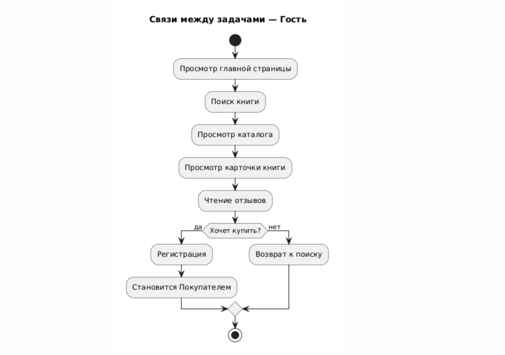
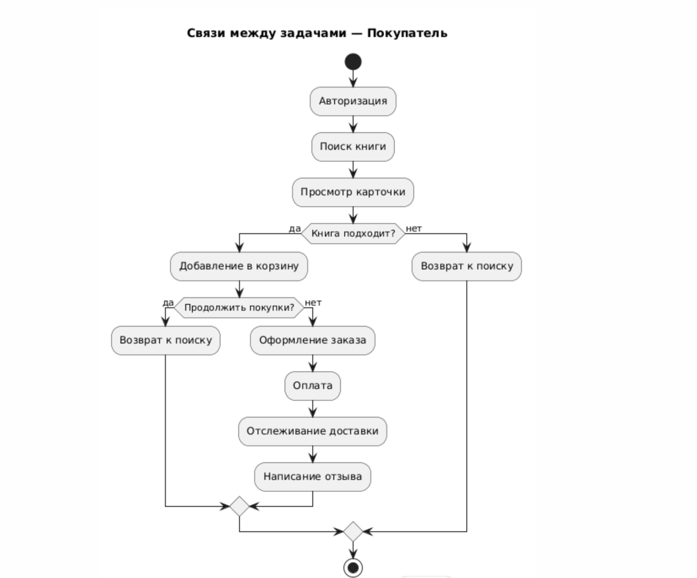
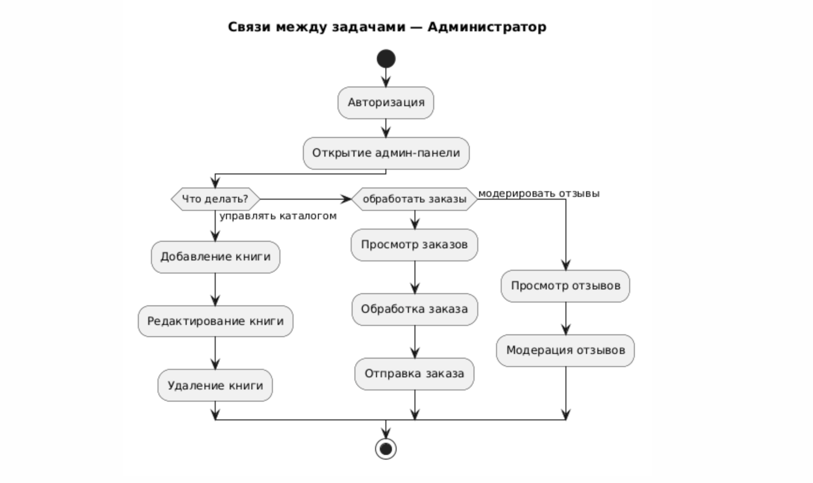
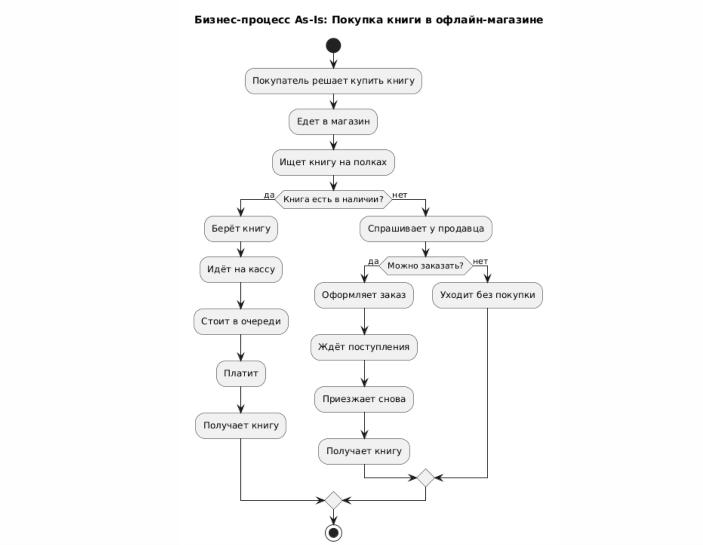
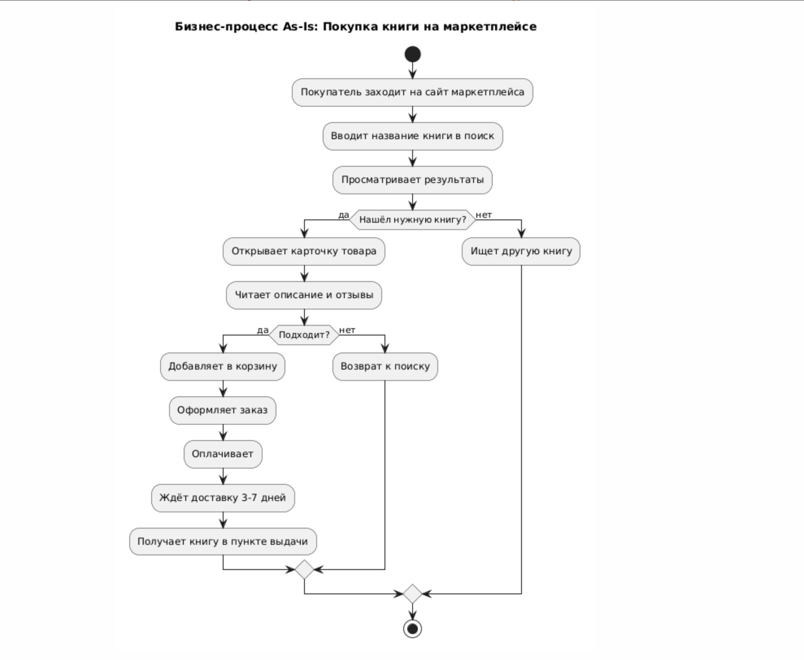
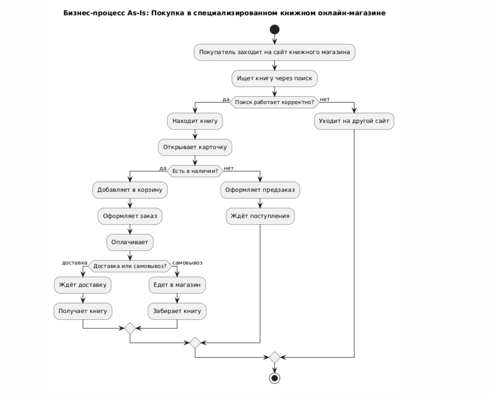

# Лабораторная работа №1

## Исследование пользователей и предметной области

**Тема проекта:** BookBox — онлайн-магазин книг.

---

## 1. Цели лабораторной работы

1. Закрепить теоретические знания по разработке пользовательского интерфейса.
2. Получить практические навыки по проведению этапов предварительного и высокоуровневого проектирования интерфейса пользователя. В частности:
   - Научиться формулировать задание на проектирование прототипа программной системы, включая требования для прототипа мобильного устройства.
   - Проводить исследования потребностей пользователей системы.
   - Анализировать собранные данные.
   - Формировать профили групп пользователей и выполнять синтез персонажей.
   - Разрабатывать контекстные сценарии взаимодействия и диаграммы бизнес-процессов.

---

## 2. Постановка задачи

### 2.1. Социальная задача

**Проблема:** Покупка книг в офлайн-магазинах занимает много времени, ассортимент ограничен, а цены часто выше, чем в интернете. Людям нужен удобный способ находить, сравнивать и покупать книги с любого устройства.

**Решение:** BookBox — онлайн-магазин книг с удобным каталогом, фильтрами, отзывами и быстрой доставкой. Доступен как веб-сайт и мобильное приложение.

**Целевая аудитория:** Люди, которые читают и покупают книги (студенты, преподаватели, обычные читатели).

### 2.2. Структура данных

Основные сущности системы:

| Сущность | Атрибуты |
|----------|----------|
| **Книга** | ID, название, автор, издательство, год, жанр, ISBN, цена, описание, обложка, рейтинг, количество на складе |
| **Пользователь (Покупатель)** | ID, имя, email, телефон, пароль, адрес доставки, история заказов, избранное |
| **Заказ** | ID, пользователь, список книг, дата, статус, сумма, адрес доставки, способ оплаты |
| **Администратор** | ID, имя, email, пароль, права доступа |
| **Отзыв** | ID, пользователь, книга, текст, оценка, дата |
| **Корзина** | ID, пользователь, список книг, количество, сумма |
| **Издательство** | ID, название, страна, сайт |
| **Жанр** | ID, название, описание |

**Связи:**
- Пользователь → Заказы (1:N)
- Заказ → Книги (M:N)
- Книга → Отзывы (1:N)
- Книга → Жанр (M:N)
- Книга → Издательство (N:1)

### 2.3. Структура деятельности

**Роли пользователей и их действия:**

| Роль | Действия |
|------|----------|
| **Гость** | Просмотр каталога, поиск книг, чтение отзывов, просмотр карточек книг |
| **Покупатель** | Регистрация, вход, добавление в корзину, оформление заказа, оплата, отслеживание доставки, написание отзывов, добавление в избранное |
| **Администратор** | Добавление/редактирование книг, управление жанрами и издательствами, обработка заказов, управление пользователями, модерация отзывов |

**Основные сценарии:**
- Поиск книги по автору, жанру, издательству.
- Добавление книги в корзину.
- Оформление заказа с указанием адреса доставки.
- Оплата заказа (онлайн или при получении).
- Просмотр истории заказов.
- Написание отзыва на книгу.
- Добавление книги в избранное.

### 2.4. Требования к физической инфраструктуре мобильного приложения

| Параметр | Требование |
|----------|------------|
| **Форм-фактор** | Смартфон (экран 5–7 дюймов) |
| **Способы управления** | Касания (тапы, свайпы), голосовой поиск (опционально) |
| **Ориентация** | Портретная (основная), ландшафтная (для чтения) |
| **Особенности** | Push-уведомления о статусе заказа, сканирование штрих-кода книги для быстрого поиска, офлайн-доступ к избранному и корзине |
| **Платформа** | Android или iOS (на выбор) |
| **Интеграции** | Серверное API BookBox-Server, платежные системы, сервисы доставки |

## 3. Анализ конкурентов

### 3.1. Список конкурентов

**Ключевые (прямые) конкуренты:**
- **Ozon.by** — локальный мультикатегорийный маркетплейс (включает книги).
- **Belkniga.by** — локальный государственный книжный магазин с онлайн-каталогом.

**Косвенные конкуренты:**
- **Wildberries.by** — локальный маркетплейс (есть раздел книг).
- **Litres** — электронные и аудиокниги.
- **21vek.by** — белорусский маркетплейс (есть книги).

### 3.2. Сравнительная таблица

| Показатель | Ozon.by | Belkniga.by |
|------------|---------|-------------|
| Месячные посещения | 21.68M | 84,618 |
| Длительность визита | 00:06:22 | 00:01:42 |
| Страниц за визит | 8.96 | 2.92 |
| Показатель отказов | 33.24% | 42.70% |
| Desktop / Mobile | 46.88% / 53.12% | 35.42% / 64.58% |
| География (топ-1) | Беларусь 93.67% | Беларусь 88.07% |
| География (топ-2) | Россия 3.91% | Россия 3.98% |
| Источники трафика (топ-1) | ozon.ru 71.63% | yandex.by 50.87% |
| Источники трафика (топ-2) | yandex.by 4.96% | Referral 49.13% |
| Интересы аудитории | Marketplace 71.99% | Search Engines 50.87% |

### 3.3. Ценовая составляющая

Оба конкурента работают в разных ценовых нишах:
- **Ozon.by** — маркетплейс, цены формируются продавцами, часто есть скидки и акции.
- **Belkniga.by** — государственная сеть, цены фиксированные, скидки по программам лояльности.

**Вывод для BookBox:** занять нишу специализированного книжного с прозрачными ценами и персональными скидками.

### 3.4. Региональная популярность

Оба конкурента ориентированы на **Беларусь** (88–93% трафика). Это значит, что BookBox должен быть адаптирован под локальный рынок: белорусские издательства, доставка по стране, оплата в BYN.

### 3.5. Каналы привлечения трафика

- **Ozon.by** — основной источник: внутренние переходы (ozon.ru), поисковики (Яндекс), соцсети (VK Video).
- **Belkniga.by** — основной источник: Яндекс (50.87%), реферальные переходы (49.13%).

**Вывод для BookBox:** сделать упор на **SEO** (Яндекс), **контент-маркетинг** (обзоры книг, подборки) и **соцсети** (Telegram, VK).

### 3.6. Потребительский портрет

- **Ozon.by** — аудитория интересуется маркетплейсами, технологиями, искусством. Широкая.
- **Belkniga.by** — аудитория интересуется книгами, поиском. Узкая, но лояльная.

**Вывод для BookBox:** целевая аудитория — люди, которые читают и покупают книги. Нужно создать удобный каталог, персональные подборки и книжный клуб.

### 3.7. Ключевые выводы

1. **Мобильный трафик преобладает** у обоих конкурентов (53–64%). Значит, мобильное приложение BookBox — обязательно.
2. **Ozon.by** — гигант по трафику (21.68M), но это мультикатегорийный маркетплейс, а не книжный.
3. **Belkniga.by** — специализированный книжный, но с низкой вовлечённостью (1:42 на сайте, 2.92 страниц за визит). Это говорит о **слабом UX**.
4. **BookBox может занять нишу** — специализированный книжный с современным интерфейсом, удобным поиском и персональными подборками.
5. **География:** 88–93% трафика из Беларуси. Продукт должен быть локальным: белорусские издательства, доставка по стране, BYN.

## 4. Опрос потенциальной аудитории

### 4.1. Методология

**Цель опроса:** понять, как потенциальные пользователи покупают книги, какие у них привычки и предпочтения, и что для них важно в онлайн-магазине книг.

**Инструмент:** Google Forms.
**Период проведения:** сентябрь 2026 г.
**Количество респондентов:** 24 человека.
**Целевая аудитория:** студенты, преподаватели, молодые специалисты (18–45 лет).

### 4.2. Вопросы опроса

1. Ваш возраст?
   - До 18
   - 18–25
   - 26–35
   - 36–45
   - 46+

2. Ваш род занятий?
   - Студент
   - Работаю
   - Не работаю
   - Другое

3. Как часто вы читаете книги?
   - Каждый день
   - Несколько раз в неделю
   - Несколько раз в месяц
   - Реже
   - Не читаю

4. В каком формате вы предпочитаете читать?
   - Бумажные книги
   - Электронные книги
   - Аудиокниги
   - Не имеет значения

5. Как часто вы покупаете книги?
   - Каждый месяц
   - Раз в 2–3 месяца
   - Раз в полгода
   - Реже
   - Не покупаю

6. Где вы обычно покупаете книги?
   - В офлайн-магазинах
   - В онлайн-магазинах (Ozon, Wildberries и др.)
   - В специализированных книжных онлайн-магазинах
   - Скачиваю бесплатно
   - Другое

7. Что для вас важно при выборе онлайн-магазина книг? (можно выбрать несколько)
   - Низкие цены
   - Широкий ассортимент
   - Удобный поиск и фильтры
   - Отзывы и рейтинги
   - Быстрая доставка
   - Программа лояльности
   - Удобное мобильное приложение

8. Пользуетесь ли вы мобильными приложениями для покупки книг?
   - Да, постоянно
   - Иногда
   - Нет, но хотел(а) бы
   - Нет, и не планирую

9. Какие функции были бы для вас полезны в приложении книжного магазина? (можно выбрать несколько)
   - Сканирование штрих-кода книги
   - Персональные подборки
   - Уведомления о скидках
   - Отслеживание заказа
   - Книжный клуб (обсуждения)
   - Список желаний (избранное)

10. Что вас чаще всего не устраивает в существующих онлайн-магазинах книг?
    - Высокие цены
    - Сложный поиск
    - Долгая доставка
    - Неудобный интерфейс
    - Мало отзывов
    - Другое

11. Готовы ли вы пользоваться новым онлайн-магазином книг, если он будет удобнее существующих?
    - Да, с удовольствием
    - Возможно, попробую
    - Скорее нет
    - Нет

12. Ваш пол?
    - Мужской
    - Женский
    - Не указывать

### 4.3. Результаты опроса

**Возраст респондентов:**
- 18–25 лет — 58%
- 26–35 лет — 29%
- 36–45 лет — 13%

**Род занятий:**
- Студенты — 54%
- Работающие — 38%
- Другое — 8%

**Частота чтения:**
- Несколько раз в неделю — 42%
- Каждый день — 25%
- Несколько раз в месяц — 21%
- Реже — 12%

**Формат чтения:**
- Бумажные книги — 54%
- Электронные — 29%
- Аудиокниги — 13%
- Не имеет значения — 4%

**Частота покупки книг:**
- Раз в 2–3 месяца — 37%
- Каждый месяц — 25%
- Раз в полгода — 21%
- Реже — 17%

**Где покупают книги:**
- В онлайн-магазинах (Ozon, Wildberries) — 46%
- В офлайн-магазинах — 25%
- В специализированных книжных онлайн-магазинах — 17%
- Скачивают бесплатно — 8%
- Другое — 4%

**Что важно при выборе магазина:**
- Низкие цены — 71%
- Широкий ассортимент — 63%
- Удобный поиск и фильтры — 58%
- Быстрая доставка — 46%
- Отзывы и рейтинги — 42%
- Программа лояльности — 25%
- Удобное мобильное приложение — 21%

**Использование мобильных приложений:**
- Иногда — 46%
- Да, постоянно — 29%
- Нет, но хотел(а) бы — 17%
- Нет, и не планирую — 8%

**Полезные функции в приложении:**
- Персональные подборки — 67%
- Уведомления о скидках — 58%
- Отслеживание заказа — 54%
- Список желаний — 50%
- Сканирование штрих-кода — 33%
- Книжный клуб — 21%

**Что не устраивает в существующих магазинах:**
- Высокие цены — 58%
- Сложный поиск — 42%
- Неудобный интерфейс — 38%
- Долгая доставка — 29%
- Мало отзывов — 21%
- Другое — 12%

**Готовность пользоваться новым магазином:**
- Да, с удовольствием — 46%
- Возможно, попробую — 42%
- Скорее нет — 8%
- Нет — 4%

**Пол:**
- Женский — 58%
- Мужской — 42%

### 4.4. Выводы по результатам опроса

1. **Аудитория преимущественно молодая** (18–35 лет) — это студенты и молодые специалисты. Они активно читают и покупают книги.
2. **Бумажные книги остаются популярными** (54%), но электронные и аудиоформаты тоже востребованы (42%).
3. **Большинство покупает книги в мультикатегорийных онлайн-магазинах** (Ozon, Wildberries — 46%), но многие недовольны высокими ценами (58%) и сложным поиском (42%).
4. **Ключевые критерии выбора магазина:** низкие цены, широкий ассортимент, удобный поиск, быстрая доставка.
5. **Мобильные приложения востребованы** — 75% респондентов либо уже пользуются, либо хотели бы попробовать.
6. **Самые полезные функции:** персональные подборки (67%), уведомления о скидках (58%), отслеживание заказа (54%), список желаний (50%).
7. **Готовность пользоваться новым магазином высокая** — 88% готовы попробовать.

**Что это значит для BookBox:**
- Нужно сделать **удобный поиск и фильтры** — это одна из главных болей.
- **Персональные подборки** и **уведомления** — важные функции.
- **Мобильное приложение** — обязательно, так как 75% аудитории им пользуются или хотят.
- **Конкурентное преимущество** — удобный интерфейс и прозрачные цены.

## 5. Профили пользователей

На основе анализа конкурентов и результатов опроса были выделены три ключевых профиля пользователей BookBox. Один из них принят за основной.

### 5.1. Основной профиль: «Студент»

**Приоритет:** самая многочисленная группа (54% опрошенных).

| Характеристика | Описание |
|----------------|----------|
| **Социальные характеристики** | |
| Пол | Преимущественно женский (58%) |
| Возраст | 18–25 лет |
| Образование | Высшее (неоконченное) |
| Уровень должности | Студент |
| Использует ли компьютер только он | Да, личный ноутбук/смартфон |
| **Навыки и умения** | |
| Общий стаж работы с компьютером | 5–10 лет |
| Стаж использования интернета | 5–10 лет |
| Уровень теоретических знаний об интернете | Средний |
| Уровень практических знаний | Уверенный пользователь: соцсети, поиск, покупки онлайн, мессенджеры |
| **Рабочая среда** | |
| Тип подключения к интернету | Wi-Fi, мобильный интернет |
| Размер монитора | Ноутбук 13–15", смартфон 5–7" |
| Экранное разрешение | Full HD и выше |
| Быстродействие компьютера | Среднее |
| Операционная система | Windows, macOS, Android, iOS |
| Язык ОС | Русский |
| Часто используемые приложения | Браузер, Telegram, VK, мессенджеры, онлайн-магазины |
| Время за компьютером на работе/учёбе | 4–6 часов |
| Время за компьютером дома | 2–4 часа |
| **Мотивационно-целевая среда** | |
| Цели пользователя | Найти нужную книгу по низкой цене, быстро оформить заказ, не переплачивать |
| Мотивация к обучению | Высокая — привык к онлайн-покупкам |

**Особенности взаимодействия с компьютером:**
- Предпочитает мобильные устройства (64% трафика у конкурентов — мобильный).
- Использует поиск и фильтры.
- Читает отзывы перед покупкой.
- Ценит скорость и простоту интерфейса.

**Специфические требования:**
- Удобный поиск с фильтрами по автору, жанру, цене.
- Возможность оплаты картой и онлайн-кошельками.
- Быстрая доставка или самовывоз.
- Скидки для студентов.

---

### 5.2. Профиль: «Молодой специалист»

**Приоритет:** платёжеспособная аудитория, приносит доход (29% опрошенных).

| Характеристика | Описание |
|----------------|----------|
| **Социальные характеристики** | |
| Пол | Женский и мужской |
| Возраст | 26–35 лет |
| Образование | Высшее |
| Уровень должности | Специалист, менеджер |
| Использует ли компьютер только он | Да, рабочий и личный |
| **Навыки и умения** | |
| Общий стаж работы с компьютером | 10+ лет |
| Стаж использования интернета | 10+ лет |
| Уровень теоретических знаний | Высокий |
| Уровень практических знаний | Продвинутый пользователь |
| **Рабочая среда** | |
| Тип подключения | Wi-Fi, оптоволокно |
| Размер монитора | 15–27" |
| Экранное разрешение | Full HD, 4K |
| Быстродействие | Высокое |
| ОС | Windows, macOS |
| Язык ОС | Русский, английский |
| Часто используемые приложения | Браузер, офисные программы, мессенджеры, онлайн-магазины |
| Время за компьютером на работе | 6–8 часов |
| Время за компьютером дома | 2–3 часа |
| **Мотивационно-целевая среда** | |
| Цели | Купить книги для саморазвития, подарки, профессиональная литература |
| Мотивация к обучению | Высокая |

**Особенности взаимодействия:**
- Ценит время — нужен быстрый поиск и оформление.
- Готов платить за удобство и качество.
- Использует как веб, так и мобильное приложение.

**Специфические требования:**
- Персональные подборки.
- Программа лояльности.
- Уведомления о скидках.
- Удобная история заказов.

---

### 5.3. Профиль: «Преподаватель / научный работник»

**Приоритет:** узкая, но лояльная аудитория (13% опрошенных).

| Характеристика | Описание |
|----------------|----------|
| **Социальные характеристики** | |
| Пол | Женский и мужской |
| Возраст | 36–45+ лет |
| Образование | Высшее, учёная степень |
| Уровень должности | Преподаватель, научный сотрудник |
| Использует ли компьютер только он | Да, рабочий |
| **Навыки и умения** | |
| Общий стаж работы с компьютером | 15+ лет |
| Стаж использования интернета | 15+ лет |
| Уровень теоретических знаний | Высокий |
| Уровень практических знаний | Уверенный пользователь |
| **Рабочая среда** | |
| Тип подключения | Wi-Fi, проводной |
| Размер монитора | 17–27" |
| Экранное разрешение | Full HD |
| Быстродействие | Среднее, высокое |
| ОС | Windows, macOS |
| Язык ОС | Русский |
| Часто используемые приложения | Браузер, офисные программы, электронные библиотеки |
| Время за компьютером на работе | 6–8 часов |
| Время за компьютером дома | 2–3 часа |
| **Мотивационно-целевая среда** | |
| Цели | Найти специализированную литературу, научные издания, учебники |
| Мотивация к обучению | Средняя — привык к традиционным магазинам |

**Особенности взаимодействия:**
- Ценит ассортимент и точность поиска.
- Читает аннотации и описания.
- Может использовать как веб, так и мобильное приложение.

**Специфические требования:**
- Широкий ассортимент специализированной литературы.
- Возможность предзаказа.
- Подписка на новинки по тематике.

---

### 5.4. Приоритизация профилей

| Профиль | Приоритет | Обоснование |
|---------|-----------|-------------|
| **Студент** | Основной | Самая многочисленная группа (54%) |
| **Молодой специалист** | Ключевой | Платёжеспособная аудитория, приносит доход |
| **Преподаватель** | Дополнительный | Узкая, но лояльная аудитория |

**Основной профиль** — «Студент» — будет использоваться для разработки основного сценария и интерфейса. Остальные профили — для дополнительных сценариев.

## 6. Профили задач

Профиль задач — это выделение категорий задач, выполняемых пользователями BookBox. Задачи сгруппированы по ролям с указанием частоты, важности и очерёдности выполнения.

### 6.1. Роли пользователей

В системе BookBox выделяются следующие роли:

| Роль | Описание |
|------|----------|
| **Гость** | Неавторизованный пользователь. Просматривает каталог, ищет книги, читает отзывы. |
| **Покупатель** | Авторизованный пользователь. Оформляет заказы, отслеживает доставку, пишет отзывы. |
| **Администратор** | Управляет каталогом, обрабатывает заказы, модерирует отзывы. |

### 6.2. Задачи роли «Гость»

| Задача | Частота | Важность | Очерёдность | Связи |
|--------|---------|----------|-------------|-------|
| Просмотр главной страницы | Высокая | Средняя | 1 | → Поиск, → Каталог |
| Поиск книги по названию/автору | Высокая | Высокая | 2 | → Просмотр карточки |
| Просмотр каталога по жанрам | Средняя | Средняя | 2 | → Просмотр карточки |
| Просмотр карточки книги | Высокая | Высокая | 3 | → Чтение отзывов, → Регистрация |
| Чтение отзывов | Средняя | Средняя | 4 | → Регистрация |
| Регистрация | Средняя | Высокая | 5 | → Оформление заказа |

**Задачи первой очереди:** поиск книги, просмотр карточки, регистрация.

### 6.3. Задачи роли «Покупатель»

| Задача | Частота | Важность | Очерёдность | Связи |
|--------|---------|----------|-------------|-------|
| Авторизация | Высокая | Высокая | 1 | → Все задачи |
| Поиск книги | Высокая | Высокая | 2 | → Просмотр карточки |
| Добавление в корзину | Высокая | Высокая | 3 | → Оформление заказа |
| Оформление заказа | Высокая | Высокая | 4 | → Оплата |
| Оплата заказа | Высокая | Высокая | 5 | → Отслеживание |
| Отслеживание доставки | Средняя | Высокая | 6 | — |
| Написание отзыва | Низкая | Средняя | 7 | → Просмотр карточки |
| Добавление в избранное | Средняя | Средняя | 3 | → Просмотр карточки |
| Просмотр истории заказов | Средняя | Средняя | 6 | → Повторный заказ |

**Задачи первой очереди:** авторизация, поиск, корзина, оформление заказа, оплата.

### 6.4. Задачи роли «Администратор»

| Задача | Частота | Важность | Очерёдность | Связи |
|--------|---------|----------|-------------|-------|
| Авторизация | Высокая | Высокая | 1 | → Все задачи |
| Добавление книги | Средняя | Высокая | 2 | → Каталог |
| Редактирование книги | Средняя | Высокая | 2 | → Каталог |
| Удаление книги | Низкая | Средняя | 2 | → Каталог |
| Управление жанрами | Низкая | Средняя | 3 | → Каталог |
| Управление издательствами | Низкая | Средняя | 3 | → Каталог |
| Обработка заказов | Высокая | Высокая | 4 | → Заказы |
| Управление пользователями | Низкая | Средняя | 5 | → Пользователи |
| Модерация отзывов | Средняя | Средняя | 6 | → Отзывы |

**Задачи первой очереди:** авторизация, добавление/редактирование книги, обработка заказов.

### 6.5. Задачи первой очереди (MVP)

Для первой версии BookBox необходимо реализовать:

1. **Регистрация и авторизация** — базовая функциональность.
2. **Каталог книг** — просмотр, поиск, фильтры.
3. **Карточка книги** — описание, цена, отзывы.
4. **Корзина** — добавление, удаление, изменение количества.
5. **Оформление заказа** — адрес, способ оплаты.
6. **Оплата** — онлайн или при получении.
7. **История заказов** — просмотр статуса.
8. **Админ-панель** — добавление книг, обработка заказов.

### 6.6. Различия в потребностях пользователей

| Роль | Ключевые потребности |
|------|----------------------|
| **Гость** | Быстрый поиск, понятный каталог, возможность читать отзывы без регистрации |
| **Покупатель** | Удобная корзина, быстрая оплата, отслеживание доставки, персональные подборки |
| **Администратор** | Удобная панель управления, массовое редактирование, статистика продаж |

### 6.7. Связи между задачами

**Гость:**

**Покупатель:**

**Администратор:**

### 6.8. Выводы по профилям задач

1. **Задачи первой очереди (MVP):** регистрация, поиск, корзина, оформление заказа, оплата, история заказов, админ-панель.
2. **Ключевая роль** — Покупатель, так как именно он приносит доход.
3. **Наибольшая частота** — у задач поиска, просмотра карточки, добавления в корзину.
4. **Наибольшая важность** — у задач оформления и оплаты заказа.
5. **Административные задачи** — менее частые, но критически важные для работы магазина.

## 7. Профиль среды

Профиль среды описывает контекст, в котором пользователи взаимодействуют с BookBox. На основе этих данных определяются требования к интерфейсу.

### 7.1. Характеристики контекста использования

| Характеристика | Признак | Влияние на интерфейс |
|----------------|---------|----------------------|
| **Место использования** | Дом, учёба, работа, транспорт (открытое и закрытое пространство) | Адаптивная вёрстка; возможность использования в дороге (мобильное приложение, офлайн-режим); яркость и контрастность для улицы |
| **Рабочее место** | Дома — просторное; на учёбе/работе — стеснённое; в транспорте — крайне стеснённое | Размер экрана: поддержка мобильных (5–7") и десктопных (15–27") разрешений; минимум элементов на мобильном, максимум — на десктопе |
| **Освещённость** | Дома — равномерная; на улице — яркое солнце; вечером — тусклая | Высокий контраст, тёмная тема, крупные шрифты, читаемость при ярком свете |
| **Аппаратное обеспечение** | Смартфоны (Android/iOS), ноутбуки (Windows/macOS), планшеты | Поддержка современных браузеров; оптимизация под мобильные устройства; умеренная ресурсоёмкость (без тяжёлых анимаций) |
| **Программное обеспечение** | ОС: Windows, macOS, Android, iOS; браузеры: Chrome, Safari, Firefox, Edge | Кроссбраузерность; поддержка стандартов HTML5/CSS3/JS; адаптивность под мобильные браузеры |
| **Прерывания** | На работе/учёбе — частые (звонки, коллеги, пары); дома — редкие | Сохранение прогресса (корзина, черновик отзыва); быстрый доступ к избранному; push-уведомления о заказах |
| **Шумность** | На улице/в транспорте — шумно; дома — тихо | Возможность использования без звука; визуальные уведомления вместо звуковых; текстовые подсказки |

### 7.2. Основные сценарии контекста

**Сценарий 1. Дома за ноутбуком (вечер).**
Пользователь спокойно листает каталог, читает отзывы, оформляет заказ. Контекст: тихо, освещение равномерное, время не ограничено. Интерфейс может быть **детальным** — с расширенными фильтрами, подробными карточками, большим количеством информации.

**Сценарий 2. В транспорте (по дороге на учёбу/работу).**
Пользователь заходит с телефона, чтобы быстро проверить статус заказа или найти книгу. Контекст: шумно, светло/темно, отвлекают. Интерфейс должен быть **минималистичным**, с крупными кнопками, быстрым поиском и без лишних шагов.

**Сценарий 3. На работе/учёбе (в перерыве).**
Пользователь быстро просматривает новинки, добавляет в избранное. Контекст: частые прерывания, стеснённое рабочее место. Интерфейс должен **сохранять прогресс** и позволять вернуться к задаче позже.

### 7.3. Выводы по профилю среды

1. **Основные устройства:** смартфон (преобладает — 64% трафика у конкурентов) и ноутбук.
2. **Основные ОС:** Android, iOS, Windows, macOS.
3. **Ключевые требования к интерфейсу:**
   - Адаптивность (мобильная и десктопная версии).
   - Высокий контраст и тёмная тема.
   - Минимализм на мобильных, детализация на десктопе.
   - Сохранение прогресса (корзина, избранное, черновики).
   - Push-уведомления о статусе заказа.
4. **Специфика мобильного приложения:** офлайн-доступ к избранному и корзине, сканирование штрих-кода, быстрый поиск.

## 8. Профили групп

На основе профилей пользователей, задач и среды сформированы три группы пользователей BookBox.

### 8.1. Группа №1. Студенты

| Характеристика | Значение |
|----------------|----------|
| Возраст | 18–25 лет |
| Образование | Неоконченное высшее, высшее |
| Семейное положение | Не женаты / не замужем |
| Срок работы | Меньше 1,5 лет (подработки, стажировки) |
| Знание продукта | Посредственное — знают, что такое онлайн-магазины, но не разбираются в деталях |
| Уровень пользователя ПК | Продвинутый — активно используют соцсети, мессенджеры, онлайн-покупки |
| Основные задачи | Поиск книг по низкой цене, покупка учебной литературы, чтение отзывов |
| Контекст использования | Мобильный (в транспорте, на парах), веб (дома) |
| Приоритет | Основной — самая многочисленная группа (54% опрошенных) |

### 8.2. Группа №2. Молодые специалисты

| Характеристика | Значение |
|----------------|----------|
| Возраст | 26–32 года |
| Образование | Высшее |
| Семейное положение | Семейные |
| Срок работы | 3–10 лет |
| Знание продукта | Хорошее — могут обучить других |
| Уровень пользователя ПК | Средний — уверенно используют офисные программы и браузер |
| Основные задачи | Покупка книг для саморазвития, подарки, профессиональная литература |
| Контекст использования | Веб (на работе, дома), мобильный (в дороге) |
| Приоритет | Ключевой — платёжеспособная аудитория (29% опрошенных) |

### 8.3. Группа №3. Преподаватели / научные работники

| Характеристика | Значение |
|----------------|----------|
| Возраст | 36+ лет |
| Образование | Высшее, учёная степень |
| Семейное положение | Семейные |
| Срок работы | 10+ лет |
| Знание продукта | Хорошее — знают, что им нужно |
| Уровень пользователя ПК | Уверенный — используют специализированные программы |
| Основные задачи | Поиск специализированной литературы, научных изданий, учебников |
| Контекст использования | Веб (на работе), реже — мобильный |
| Приоритет | Дополнительный — узкая, но лояльная аудитория (13% опрошенных) |

### 8.4. Сравнение групп

| Критерий | Студенты | Молодые специалисты | Преподаватели |
|----------|----------|---------------------|----------------|
| Возраст | 18–25 | 26–32 | 36+ |
| Частота покупок | Раз в 2–3 месяца | Каждый месяц | Раз в полгода |
| Основное устройство | Смартфон | Смартфон + ноутбук | Ноутбук |
| Ключевая потребность | Низкая цена | Удобство и скорость | Ассортимент |
| Приоритет | Основной | Ключевой | Дополнительный |

### 8.5. Выводы по профилям групп

1. **Основная группа** — студенты (54%). Для них важны низкие цены, мобильное приложение, скидки.
2. **Ключевая группа** — молодые специалисты (29%). Они приносят доход, ценят удобство и готовы платить.
3. **Дополнительная группа** — преподаватели (13%). Узкая, но лояльная аудитория, которой важен ассортимент.
4. **Общие черты:** все группы используют онлайн-магазины, большинство — с мобильных устройств.
5. **Различия:** студентам важна цена, специалистам — удобство, преподавателям — ассортимент.

## 9. Персонажи

На основе профилей пользователей, среды и задач разработаны персонажи BookBox. Каждый персонаж представляет определённый тип аудитории и используется для проектирования интерфейса.

### 9.1. Ключевой персонаж №1. Аня, 20 лет

**Фотография:** *(изображение будет добавлено)*

**Социальное положение:**
Студентка 2 курса факультета прикладной математики. Живёт в общежитии, подрабатывает репетитором. Не замужем.

**Цели:**
- Найти учебную литературу по низкой цене.
- Быстро оформить заказ между парами.
- Не переплачивать — студенческий бюджет ограничен.

**Описание рабочего процесса:**
Учится с утра до вечера, много читает. Ищет книги в перерывах между парами со смартфона. Покупает в основном учебники и художественную литературу по акциям.

**Описание окружения:**
Общежитие, учебные аудитории, транспорт. Wi-Fi в вузе и мобильный интернет. Пользуется Android-смартфоном и старым ноутбуком.

**Уровень подготовки:**
Продвинутый пользователь ПК и смартфона. Активно использует соцсети, мессенджеры, онлайн-магазины.

**Неудовлетворённости и ожидания:**
- Не устраивают высокие цены в офлайн-магазинах.
- Раздражает сложный поиск и отсутствие фильтров по цене.
- Ожидает: скидки для студентов, быстрый поиск, удобное мобильное приложение.

**«Художественные» элементы:**
Аня всегда носит наушники и читает в метро. У неё есть список «хочу прочитать», который она ведёт в заметках телефона.

---

### 9.2. Ключевой персонаж №2. Дмитрий, 29 лет

**Фотография:** *(изображение будет добавлено)*

**Социальное положение:**
Менеджер в IT-компании. Женат, есть ребёнок. Живёт в Минске.

**Цели:**
- Найти книги для саморазвития и профессионального роста.
- Купить подарки друзьям и коллегам.
- Сэкономить время — заказ в один клик.

**Описание рабочего процесса:**
Работает 8 часов в офисе, дома читает. Покупает книги раз в месяц. Ценит удобство и скорость. Готов платить за качественный сервис.

**Описание окружения:**
Офис, дом, командировки. Быстрый интернет, MacBook, iPhone. Часто в дороге — использует мобильное приложение.

**Уровень подготовки:**
Средний — уверенно пользуется браузером и офисными программами, но не разбирается в технических деталях.

**Неудовлетворённости и ожидания:**
- Не любит долгие процессы оформления заказа.
- Раздражает отсутствие уведомлений о статусе доставки.
- Ожидает: персональные подборки, удобную историю заказов, push-уведомления.

**«Художественные» элементы:**
Дмитрий ведёт список книг в Notion. Он любит дарить книги с заметками на полях.

---

### 9.3. Ключевой персонаж №3. Ольга Петровна, 48 лет

**Фотография:** *(изображение будет добавлено)*

**Социальное положение:**
Преподаватель университета, кандидат наук. Замужем, двое детей. Живёт в Минске.

**Цели:**
- Найти специализированную литературу и научные издания.
- Получать новинки по своей тематике.
- Иметь доступ к редким книгам.

**Описание рабочего процесса:**
Работает в университете, ведёт научную деятельность. Покупает книги реже, но целенаправленно. Ценит ассортимент и точность поиска.

**Описание окружения:**
Университет, дом. Стационарный компьютер, ноутбук. Интернет — проводной и Wi-Fi.

**Уровень подготовки:**
Уверенный пользователь — использует специализированные программы, электронные библиотеки.

**Неудовлетворённости и ожидания:**
- Не хватает специализированной литературы в обычных магазинах.
- Сложно найти редкие издания.
- Ожидает: широкий ассортимент, точный поиск, подписку на новинки.

**«Художественные» элементы:**
Ольга Петровна ведёт картотеку прочитанных книг в тетради. Она не доверяет электронным книгам, предпочитает бумажные.

---

### 9.4. Дополнительный персонаж. Максим, 24 года

**Фотография:** *(изображение будет добавлено)*

**Социальное положение:**
Курьер службы доставки. Не женат. Работает в Минске.

**Цели:**
- Быстро доставлять заказы.
- Получать чёткие адреса и контакты клиентов.
- Минимизировать количество ошибок.

**Описание рабочего процесса:**
Получает заказы через приложение курьера. Работает с адресами, звонит клиентам, подтверждает доставку.

**Описание окружения:**
Улица, транспорт, подъезды. Смартфон с мобильным интернетом.

**Уровень подготовки:**
Средний — пользуется приложением курьера, картами, мессенджерами.

**Неудовлетворённости и ожидания:**
- Неточные адреса, недоступные телефоны.
- Ожидает: чёткие данные о заказе, интеграцию с картами.

---

### 9.5. Вспомогательный персонаж. Сергей, 33 года

**Фотография:** *(изображение будет добавлено)*

**Социальное положение:**
Администратор BookBox. Женат. Работает в офисе.

**Цели:**
- Поддерживать актуальность каталога.
- Обрабатывать заказы быстро и без ошибок.
- Отвечать на отзывы клиентов.

**Описание рабочего процесса:**
Работает с админ-панелью BookBox. Добавляет новые книги, редактирует цены, обрабатывает заказы, модерирует отзывы.

**Описание окружения:**
Офис, стационарный компьютер, два монитора.

**Уровень подготовки:**
Продвинутый — уверенно работает с админ-панелями, таблицами, аналитикой.

**Неудовлетворённости и ожидания:**
- Неудобный интерфейс админки замедляет работу.
- Ожидает: массовое редактирование, фильтры, статистику.

---

### 9.6. Заказчик. Ирина, 41 год

**Фотография:** *(изображение будет добавлено)*

**Социальное положение:**
Владелец BookBox. Замужем, двое детей. Живёт в Минске.

**Цели:**
- Сделать BookBox прибыльным.
- Привлечь как можно больше клиентов.
- Обогнать конкурентов по удобству.

**Описание рабочего процесса:**
Управляет бизнесом, принимает стратегические решения, следит за метриками.

**Описание окружения:**
Офис, ноутбук, смартфон. Часто в разъездах.

**Уровень подготовки:**
Средний — понимает бизнес-процессы, но не технические детали.

**Неудовлетворённости и ожидания:**
- Конкуренты (Ozon, Wildberries) забирают аудиторию.
- Ожидает: рост продаж, лояльность клиентов, узнаваемость бренда.

---

### 9.7. Анти-персонаж. Виктор, 38 лет

**Фотография:** *(изображение будет добавлено)*

**Социальное положение:**
Инженер. Женат. Живёт в Гомеле.

**Цели:**
- Покупать книги только в офлайн-магазинах.
- Не доверять онлайн-оплате.
- Избегать «навязанных» сервисов.

**Описание рабочего процесса:**
Покупает книги редко, в основном в букинистических магазинах. Не пользуется онлайн-магазинами.

**Описание окружения:**
Дом, работа. Старый компьютер, кнопочный телефон.

**Уровень подготовки:**
Низкий — не доверяет интернет-технологиям, боится мошенничества.

**Неудовлетворённости и ожидания:**
- Считает, что онлайн-магазины — это «обман».
- Ожидает: гарантии, прозрачность, возможность оплаты при получении.

**Роль в проекте:**
Анти-персонаж показывает, что BookBox **не должен** ориентироваться на эту аудиторию. Он помогает команде не тратить ресурсы на тех, кто не станет клиентом.

## 10. Контекстные сценарии персонажей

Контекстные сценарии описывают, как каждый персонаж решает свою задачу через BookBox. Каждый сценарий включает основной путь, альтернативные пути и исключения.

### 10.1. Сценарии Ани (студентка, 20 лет)

**Цель:** купить учебник по низкой цене.

#### Сценарий 1. Поиск книги по акции

**Основной путь:**
1. Аня открывает мобильное приложение BookBox.
2. Вводит в поиск «Математический анализ».
3. Применяет фильтр «Цена до 30 BYN».
4. Видит список книг. Открывает карточку первой.
5. Читает описание и отзывы.
6. Добавляет в корзину.
7. Оформляет заказ, оплачивает картой.
8. Получает уведомление о статусе заказа.

**Альтернативный путь:**
- Аня не находит нужную книгу по фильтру. Меняет цену до 50 BYN → находит.
- Или переходит в раздел «Скидки для студентов» → находит похожую книгу дешевле.

**Исключения:**
- Нет интернета → приложение показывает сохранённую корзину, предлагает оформить заказ позже.
- Книга закончилась → предлагается подписка на уведомление о поступлении.

#### Сценарий 2. Покупка в перерыве между парами

**Основной путь:**
1. Аня заходит в приложение со смартфона.
2. Проверяет уведомление о скидке на книгу из избранного.
3. Переходит в карточку → добавляет в корзину.
4. Оформляет заказ в один клик (адрес и оплата сохранены).
5. Получает подтверждение.

**Альтернативный путь:**
- Аня решает отложить покупку → добавляет в «Избранное» → возвращается вечером.

**Исключения:**
- Преподаватель отвлёк → приложение сохраняет прогресс → Аня возвращается к заказу позже.

---

### 10.2. Сценарии Дмитрия (молодой специалист, 29 лет)

**Цель:** купить книгу в подарок коллеге.

#### Сценарий 1. Покупка книги в подарок

**Основной путь:**
1. Дмитрий открывает BookBox на ноутбуке.
2. Ищет книгу по названию.
3. Читает описание, смотрит рейтинг.
4. Добавляет в корзину.
5. На этапе оформления выбирает «Подарочная упаковка».
6. Указывает адрес коллеги.
7. Оплачивает онлайн.
8. Получает уведомление о доставке.

**Альтернативный путь:**
- Дмитрий не уверен в выборе → переходит в раздел «Персональные подборки» → выбирает из рекомендованных.

**Исключения:**
- Книга недоступна → предлагается похожая.
- Ошибка оплаты → предлагается другой способ.

#### Сценарий 2. Заказ в один клик

**Основной путь:**
1. Дмитрий заходит в приложение.
2. Видит в разделе «Рекомендации» книгу, которая ему интересна.
3. Нажимает «Купить в один клик».
4. Заказ оформлен, оплата списана.

**Альтернативный путь:**
- Хочет изменить адрес → переходит в настройки → меняет.

**Исключения:**
- Нет денег на карте → предлагается другой способ оплаты.

---

### 10.3. Сценарии Ольги Петровны (преподаватель, 48 лет)

**Цель:** найти редкое научное издание.

#### Сценарий 1. Поиск редкого издания

**Основной путь:**
1. Ольга Петровна открывает BookBox на ноутбуке.
2. Использует расширенный поиск: автор, издательство, год.
3. Находит издание.
4. Оформляет предзаказ.
5. Получает уведомление о поступлении.
6. Оплачивает и получает книгу.

**Альтернативный путь:**
- Не находит → оставляет заявку на поиск книги.
- Или подписывается на уведомления о новинках по теме.

**Исключения:**
- Книга не издаётся → предлагается электронная версия.

#### Сценарий 2. Подписка на новинки

**Основной путь:**
1. Ольга Петровна заходит в личный кабинет.
2. Настраивает подписку на жанр «Научная литература».
3. Указывает периодичность уведомлений.
4. Получает письма о новинках.

**Альтернативный путь:**
- Отключает подписку → удаляет из настроек.

**Исключения:**
- Письма попадают в спам → в настройках есть инструкция.

---

### 10.4. Сценарии Максима (курьер, 24 года)

**Цель:** доставить заказ вовремя.

#### Сценарий 1. Доставка заказа

**Основной путь:**
1. Максим получает уведомление о новом заказе в приложении курьера.
2. Видит адрес, телефон клиента, состав заказа.
3. Строит маршрут через карту.
4. Приезжает, звонит клиенту.
5. Передаёт заказ, подтверждает доставку в приложении.

**Альтернативный путь:**
- Клиент не отвечает → оставляет уведомление, переносит доставку.

**Исключения:**
- Адрес неточный → звонит в поддержку.

---

### 10.5. Сценарии Сергея (администратор, 33 года)

**Цель:** добавить новую книгу в каталог.

#### Сценарий 1. Добавление книги

**Основной путь:**
1. Сергей входит в админ-панель.
2. Переходит в раздел «Каталог» → «Добавить книгу».
3. Заполняет поля: название, автор, издательство, цена, описание, обложка.
4. Нажимает «Сохранить».
5. Книга появляется в каталоге.

**Альтернативный путь:**
- Импортирует данные из CSV.

**Исключения:**
- Ошибка в данных → система подсвечивает поле.

#### Сценарий 2. Обработка заказа

**Основной путь:**
1. Сергей видит новый заказ в админ-панели.
2. Проверяет наличие книги.
3. Подтверждает заказ.
4. Передаёт в доставку.

**Альтернативный путь:**
- Книги нет → связывается с клиентом.

**Исключения:**
- Ошибка оплаты → заказ отменяется автоматически.

---

### 10.6. Сценарии Ирины (заказчик, 41 год)

**Цель:** оценить эффективность BookBox.

#### Сценарий 1. Просмотр статистики

**Основной путь:**
1. Ирина заходит в админ-панель.
2. Открывает раздел «Аналитика».
3. Смотрит продажи за месяц, популярные книги, активность пользователей.
4. Принимает решения по ассортименту и маркетингу.

**Альтернативный путь:**
- Экспортирует отчёт в Excel.

**Исключения:**
- Данные не загрузились → обновляет страницу.

---

### 10.7. Сценарии Виктора (анти-персонаж, 38 лет)

**Цель:** купить книгу, не доверяя онлайн-оплате.

#### Сценарий 1. Попытка купить офлайн

**Основной путь:**
1. Виктор заходит на сайт BookBox.
2. Находит нужную книгу.
3. Видит, что оплата только онлайн.
4. Закрывает сайт и идёт в офлайн-магазин.

**Альтернативный путь:**
- Замечает опцию «Оплата при получении» → всё-таки оформляет заказ.

**Исключения:**
- Нет такой опции → уходит.

**Вывод:** анти-персонаж показывает, что для Виктора нужна опция «оплата при получении». Но не стоит тратить ресурсы на тех, кто в принципе не доверяет онлайн-покупкам.

---

### 10.8. Выводы по контекстным сценариям

1. **Основные сценарии** связаны с поиском, покупкой и доставкой книг.
2. **Ключевые функции** для большинства персонажей: поиск, фильтры, корзина, оплата, уведомления.
3. **Различия:**
   - Аня — мобильное приложение, скидки, быстрый заказ.
   - Дмитрий — персональные подборки, подарочная упаковка, заказ в один клик.
   - Ольга Петровна — расширенный поиск, предзаказ, подписка.
   - Сергей — админ-панель, массовые операции.
   - Ирина — аналитика и отчёты.
4. **Анти-персонаж Виктор** показывает важность опции «оплата при получении», но не является целевой аудиторией.

## 11. Анализ задач и ролей пользователей

На основе профилей задач и персонажей сформирована матрица «задача — роль пользователя». Она показывает, какие задачи доступны каждой роли в системе BookBox.

### 11.1. Роли пользователей

В системе BookBox выделяются следующие роли:
- **Гость** — неавторизованный пользователь.
- **Покупатель** — авторизованный пользователь, оформляющий заказы.
- **Администратор** — управляет каталогом и заказами.

### 11.2. Матрица «задача — роль пользователя»

| Составляющие процесса продажи | Гость | Покупатель | Администратор |
|-------------------------------|:-----:|:----------:|:-------------:|
| Регистрация | | + | |
| Авторизация | | + | + |
| Просмотр главной страницы | + | + | + |
| Поиск книги | + | + | + |
| Просмотр каталога по жанрам | + | + | + |
| Просмотр карточки книги | + | + | + |
| Чтение отзывов | + | + | + |
| Добавление в избранное | | + | |
| Добавление в корзину | | + | |
| Оформление заказа | | + | |
| Оплата заказа | | + | |
| Отслеживание доставки | | + | |
| Просмотр истории заказов | | + | + |
| Написание отзыва | | + | |
| Отмена заказа | | + | + |
| Управление каталогом (добавление/редактирование/удаление книг) | | | + |
| Управление жанрами и издательствами | | | + |
| Обработка заказов | | | + |
| Управление пользователями | | | + |
| Модерация отзывов | | | + |
| Просмотр статистики и отчётов | | | + |

### 11.3. Выводы по матрице

1. **Гость** имеет доступ только к просмотру — каталог, поиск, карточки, отзывы.
2. **Покупатель** получает полный доступ к покупкам: корзина, заказ, оплата, отзывы, история.
3. **Администратор** управляет контентом и заказами: каталог, заказы, отзывы, пользователи, статистика.
4. **Ключевые задачи** — поиск, просмотр карточки, оформление заказа — доступны на разных уровнях в зависимости от роли.
5. **Регистрация** — точка перехода из роли «Гость» в роль «Покупатель».

## 12. Объектная модель

Объектная модель систематизирует все объекты BookBox, их характеристики и связи. Она помогает понять интерфейс через ментальную модель пользователя.

### 12.1. Типы объектов

В BookBox выделяются два типа объектов:

- **Объекты-данные:** Книга, Заказ, Пользователь, Отзыв, Корзина, Издательство, Жанр.
- **Функциональные объекты:** Поиск, Фильтр, Сортировка, Избранное.

### 12.2. Список объектов и их характеристики

| Объект | Мощность | Представления | Действия | Атрибуты |
|--------|----------|---------------|----------|----------|
| **Книга** | Тысячи | • список (каталог) • карточка (детальное) • краткое (в корзине) | • просмотреть • искать • добавить в корзину • добавить в избранное • написать отзыв | • название • автор • издательство • год • жанр • ISBN • цена • описание • обложка • рейтинг • количество на складе |
| **Пользователь (Покупатель)** | Тысячи | • профиль • список (для админа) | • зарегистрироваться • авторизоваться • редактировать профиль • просмотреть историю заказов | • имя • email • телефон • пароль • адрес доставки • избранное • история заказов |
| **Заказ** | Тысячи | • список • детальное • статус | • создать • оплатить • отменить • отслеживать • просмотреть | • номер • пользователь • список книг • дата • статус • сумма • адрес доставки • способ оплаты |
| **Отзыв** | Сотни | • список (под книгой) • детальное | • написать • редактировать • удалить • просмотреть | • текст • оценка • дата • автор • книга |
| **Корзина** | Одна на пользователя | • список • сводка | • добавить • удалить • изменить количество • очистить • оформить | • список книг • количество • сумма |
| **Издательство** | Десятки | • список • детальное | • просмотреть • искать | • название • страна • сайт |
| **Жанр** | Десятки | • список • детальное | • просмотреть • искать • фильтровать | • название • описание |
| **Избранное** | Одно на пользователя | • список | • добавить • удалить • просмотреть | • список книг • дата добавления |
| **Поиск** (функц.) | Один | • строка поиска • расширенный поиск | • искать • очистить • фильтровать | • текстовое поле • фильтры (жанр, цена, автор) |
| **Фильтр** (функц.) | Один | • панель фильтров | • применить • сбросить | • жанр • цена • автор • издательство • год |

### 12.3. Связи между объектами
Пользователь 1──N Заказ    
Заказ N──M Книга   
Книга 1──N Отзыв  
Книга N──1 Издательство  
Книга N──M Жанр.  
Пользователь 1──1 Корзина  
Пользователь 1──1 Избранное  

**Расшифровка:**
- Один пользователь может иметь много заказов.
- Один заказ может содержать много книг, и одна книга может быть в многих заказах.
- Одна книга может иметь много отзывов.
- Одна книга принадлежит одному издательству.
- Одна книга может относиться к нескольким жанрам.
- У пользователя одна корзина и один список избранного.

### 12.4. Соответствие объектов персонажам

| Объект | Аня | Дмитрий | Ольга Петровна | Максим | Сергей | Ирина | Виктор |
|--------|:---:|:-------:|:--------------:|:------:|:------:|:-----:|:------:|
| Книга | + | + | + | | + | + | + |
| Пользователь (Покупатель) | + | + | + | | | | |
| Заказ | + | + | + | + | + | + | |
| Отзыв | + | + | + | | + | | |
| Корзина | + | + | + | | | | |
| Издательство | | + | + | | + | | |
| Жанр | + | + | + | | + | | |
| Избранное | + | + | + | | | | |
| Поиск | + | + | + | | + | + | + |
| Фильтр | + | + | + | | + | + | |

### 12.5. Выводы по объектной модели

1. **Ключевые объекты:** Книга, Заказ, Пользователь — основа системы.
2. **Функциональные объекты:** Поиск и Фильтр — критичны для навигации по каталогу.
3. **Наибольшее количество связей** — у объекта «Книга» (с заказами, отзывами, жанрами, издательствами).
4. **Все персонажи** (кроме Виктора) активно взаимодействуют с объектами «Книга» и «Поиск».
5. **Администратор (Сергей)** и **заказчик (Ирина)** работают со всеми объектами, включая управление.
6. **Анти-персонаж Виктор** взаимодействует только с «Книгой» и «Поиском», что подтверждает его низкую вовлечённость.

## 13. Стратегия дизайна

Стратегия дизайна обобщает результаты исследований лабораторной работы №1 и описывает основные цели и задачи проектирования BookBox.

### 13.1. Заинтересованные стороны

| Сторона | Интерес |
|---------|---------|
| **Владелец BookBox (Ирина)** | Прибыль, рост клиентской базы, узнаваемость бренда |
| **Покупатели (Аня, Дмитрий, Ольга Петровна)** | Удобный поиск, низкие цены, быстрая доставка |
| **Администратор (Сергей)** | Удобная панель управления каталогом и заказами |
| **Курьер (Максим)** | Чёткие данные о заказах, интеграция с картами |
| **Издательства** | Продажа книг через платформу |
| **Платёжные системы** | Обработка онлайн-платежей |
| **Службы доставки** | Логистика заказов |
| **Команда разработки** | Чёткие требования, реалистичные сроки |

### 13.2. Видение продукта (задачи продукта)

**BookBox** — это онлайн-магазин книг с удобным каталогом, быстрым поиском, персональными подборками и доставкой по Беларуси. Доступен как веб-сайт и мобильное приложение.

**Задачи продукта:**
1. Дать пользователям удобный способ находить и покупать книги.
2. Обеспечить быстрый поиск с фильтрами по автору, жанру, цене, издательству.
3. Предоставить возможность читать отзывы и оставлять свои.
4. Упростить оформление заказа — в том числе «в один клик».
5. Обеспечить отслеживание доставки.
6. Дать администратору удобную панель управления каталогом и заказами.

### 13.3. Конфликты и противоречия

| Конфликт | Стороны | Решение |
|----------|---------|---------|
| Цена vs качество сервиса | Покупатели vs Владелец | Гибкая ценовая политика, скидки для постоянных клиентов |
| Широкий ассортимент vs скорость поиска | Покупатели vs Администратор | Умные фильтры, персональные подборки, поиск по ISBN |
| Мобильное приложение vs веб-версия | Покупатели vs Команда | Приоритет — мобильное приложение (64% трафика), но веб-версия обязательна |
| Оплата онлайн vs оплата при получении | Покупатели vs Владелец | Обе опции доступны, но онлайн-оплата поощряется скидкой |
| Реклама vs удобство | Владелец vs Покупатели | Минимум рекламы, только релевантные рекомендации |

### 13.4. Задачи бизнеса, маркетинга и брендинга

**Задачи бизнеса (верифицируемые):**
1. Привлечь 1000 пользователей в первые 3 месяца.
2. Обеспечить 100 заказов в месяц к концу первого полугодия.
3. Достичь среднего чека не менее 30 BYN.
4. Обеспечить возврат 30% клиентов (повторные покупки).

**Задачи маркетинга:**
1. Продвижение через SEO (Яндекс, Google).
2. Контент-маркетинг: обзоры книг, подборки, рецензии.
3. Соцсети: Telegram, VK, Instagram.
4. Партнёрство с издательствами и книжными клубами.

**Задачи брендинга:**
1. Создать образ «уютного книжного магазина».
2. Ассоциироваться с качеством, удобством и любовью к книгам.
3. Отличаться от маркетплейсов (Ozon, Wildberries) специализацией.

### 13.5. Измеримые критерии успешности

| Критерий | Целевое значение |
|----------|------------------|
| Количество пользователей | 1000+ за 3 месяца |
| Количество заказов | 100+ в месяц |
| Средний чек | 30+ BYN |
| Доля повторных покупок | 30%+ |
| Конверсия из гостя в покупателя | 10%+ |
| Время оформления заказа | ≤ 3 минут |
| Показатель отказов | ≤ 35% |
| Средняя оценка приложения | 4.5+ из 5 |

### 13.6. Технические возможности и ограничения

**Технологии и платформы:**
- **Веб-приложение:** HTML5, CSS3, JavaScript (фреймворк — на выбор: React, Vue, Angular).
- **Мобильное приложение:** Android (Kotlin/Java) или iOS (Swift), либо кроссплатформенно (React Native, Flutter).
- **Серверная часть:** Python (Django/Flask), PHP (Laravel/Yii), Ruby on Rails или Node.js.
- **База данных:** PostgreSQL или MySQL.
- **API:** REST или GraphQL.
- **Хостинг:** облачный (GitHub Pages для документации, VPS для сервера).

**Интеграции:**
- Платёжные системы (карты, электронные кошельки).
- Службы доставки.
- Сервисы аналитики (Google Analytics, Яндекс.Метрика).
- Email-рассылки и push-уведомления.

**Ограничения:**
- Бюджет — учебный проект.
- Сроки — один семестр.
- Команда — 1 разработчик.
- Ограниченный доступ к реальным платёжным системам.

### 13.7. Представления о пользователях (целевая аудитория)

**Целевая аудитория:**
- Студенты (18–25 лет) — основная группа.
- Молодые специалисты (26–32 года) — платёжеспособная группа.
- Преподаватели и научные работники (36+) — лояльная группа.

**Общие черты:**
- Живут в Беларуси.
- Читают книги регулярно.
- Покупают онлайн.
- Используют смартфоны и ноутбуки.
- Ценят удобство, скорость и низкие цены.

**Не целевая аудитория (анти-персонаж):**
- Люди, не доверяющие онлайн-покупкам (Виктор).

### 13.8. Бюджет и график проекта

**Бюджет (учебный проект):**
- Разработка — 0 BYN (силами студента).
- Хостинг — 0 BYN (GitHub Pages для документации).
- Домен — опционально (10–15 BYN/год).
- Платёжные системы — тестовый режим.
- Реклама — 0 BYN (органика).

**График проекта (семестр):**

| Этап | Срок |
|------|------|
| Лабораторная работа №1: исследование | Сентябрь–октябрь |
| Лабораторная работа №2–3: проектирование | Октябрь–ноябрь |
| Лабораторная работа №4–6: разработка | Ноябрь–декабрь |
| Лабораторная работа №7–8: тестирование | Декабрь |
| Защита проекта | Декабрь–январь |

## 14. Бизнес-процессы (As-Is)

Бизнес-процессы As-Is описывают, как покупка книг происходит **сейчас**, до появления BookBox. Это позволяет выявить проблемы и обосновать необходимость нового приложения.

### 14.1. Покупка книги в офлайн-магазине

**Проблемы:**
- Трата времени на поездку.
- Ограниченный ассортимент.
- Очереди на кассе.
- Возможная недоступность книги.

### 14.2. Покупка книги на маркетплейсе (Ozon, Wildberries)

**Проблемы:**
- Сложно найти именно книги среди миллионов товаров.
- Много отвлекающих товаров.
- Долгая доставка (3–7 дней).
- Нет специализации на книгах.

### 14.3. Покупка в специализированном книжном онлайн-магазине

**Проблемы:**
- Устаревший интерфейс.
- Слабый поиск.
- Нет мобильного приложения.
- Медленное оформление заказа.

### 14.4. Выводы

| Проблема As-Is | Решение BookBox |
|----------------|-----------------|
| Трата времени на поездку | Онлайн-покупка из любой точки |
| Ограниченный ассортимент | Широкий каталог книг |
| Сложный поиск | Умные фильтры и поиск |
| Долгая доставка | Быстрая доставка или самовывоз |
| Устаревший интерфейс | Современный UX, мобильное приложение |

## 15. Общие выводы по лабораторной работе

В ходе выполнения лабораторной работы №1 было проведено исследование пользователей и предметной области для проекта **BookBox** — онлайн-магазина книг с веб-сайтом и мобильным приложением.

### 15.1. Что было сделано

1. **Сформулирована постановка задачи:** определена социальная задача, структура данных и структура деятельности BookBox, а также требования к мобильному приложению.
2. **Проведён анализ конкурентов:** рассмотрены Ozon.by и Belkniga.by, выявлены их сильные и слабые стороны. Ozon.by — лидер по трафику (21.68M), но это мультикатегорийный маркетплейс. Belkniga.by — специализированный книжный, но с низкой вовлечённостью (1:42 на сайте, 2.92 страниц за визит).
3. **Проведён опрос потенциальной аудитории:** 24 респондента, преимущественно 18–35 лет (студенты и молодые специалисты). Основные критерии выбора магазина — низкие цены, широкий ассортимент, удобный поиск.
4. **Разработаны профили пользователей:** выделены три профиля — Студент (основной), Молодой специалист (ключевой), Преподаватель (дополнительный).
5. **Разработаны профили задач:** описаны задачи для ролей Гость, Покупатель, Администратор с указанием частоты, важности и очерёдности.
6. **Разработан профиль среды:** определены контексты использования (дом, учёба, работа, транспорт), требования к интерфейсу (адаптивность, контраст, тёмная тема, сохранение прогресса).
7. **Разработаны профили групп:** три группы — Студенты (54%), Молодые специалисты (29%), Преподаватели (13%).
8. **Выделены персонажи:** 3 ключевых (Аня, Дмитрий, Ольга Петровна), 1 дополнительный (Максим), 1 вспомогательный (Сергей), заказчик (Ирина), анти-персонаж (Виктор).
9. **Разработаны контекстные сценарии:** для каждого персонажа описаны основной путь, альтернативные пути и исключения.
10. **Проанализированы задачи и роли:** составлена матрица «задача — роль пользователя».
11. **Разработана объектная модель:** выделены объекты-данные (Книга, Заказ, Пользователь, Отзыв, Корзина, Издательство, Жанр) и функциональные объекты (Поиск, Фильтр), определены их атрибуты, действия и связи.
12. **Описана стратегия дизайна:** определены заинтересованные стороны, видение продукта, конфликты, задачи бизнеса, критерии успешности, технические ограничения, целевая аудитория, бюджет и график.
13. **Построены бизнес-процессы As-Is:** описаны три текущих процесса покупки книг (офлайн-магазин, маркетплейс, специализированный магазин) и выявлены их проблемы.

### 15.2. Ключевые выводы

1. **Мобильное приложение обязательно.** 64% трафика у конкурентов — мобильный. 75% опрошенных пользуются или хотели бы пользоваться мобильными приложениями.

2. **Специализированный книжный магазин — свободная ниша.** Ozon и Wildberries — гиганты, но они не специализируются на книгах. Belkniga.by — специализированный, но со слабым UX. BookBox может занять нишу между ними.

3. **Основная аудитория — студенты и молодые специалисты** (83% опрошенных). Для них важны низкие цены, удобный поиск, быстрая доставка.

4. **Ключевые функции:** удобный поиск с фильтрами, персональные подборки, уведомления о скидках, отслеживание заказа, список желаний.

5. **Основные боли пользователей:** высокие цены (58%), сложный поиск (42%), неудобный интерфейс (38%).

6. **Готовность пользоваться новым магазином высокая** — 88% респондентов готовы попробовать.

7. **Технические требования:** адаптивность (мобильная + десктопная версии), высокий контраст, тёмная тема, сохранение прогресса, push-уведомления.

### 15.3. Что это значит для дальнейшего проектирования

1. **Приоритет — мобильное приложение**, но веб-версия тоже обязательна.
2. **Ключевые экраны:** каталог, карточка книги, корзина, оформление заказа, личный кабинет, админ-панель.
3. **Обязательные функции MVP:** регистрация, поиск, корзина, оформление заказа, оплата, история заказов, админ-панель.
4. **Дополнительные функции:** персональные подборки, уведомления, книжный клуб, сканирование штрих-кода.
5. **Дизайн-стратегия:** минимализм на мобильном, детализация на десктопе, акцент на удобство поиска и оформления заказа.

### 15.4. Заключение

Лабораторная работа №1 позволила получить полное представление о целевой аудитории, конкурентах и предметной области BookBox. Собранные данные будут использованы для проектирования пользовательского интерфейса на следующих этапах.

Основные результаты исследования:
- Выявлены потребности и ожидания пользователей.
- Определены конкуренты и их слабые стороны.
- Сформулированы требования к функциональности и интерфейсу.
- Построена объектная модель и бизнес-процессы.
- Описана стратегия дизайна.

**Следующий этап:** проектирование пользовательского интерфейса и разработка прототипов.
